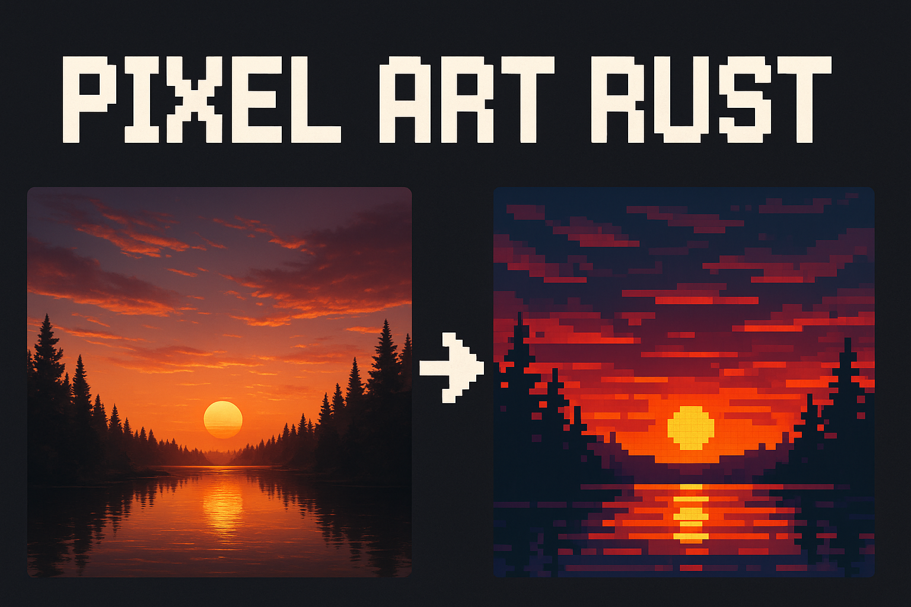

# 🎨 Pixel Art Rust

<p align="center">
  
</p>

<p align="center">
  <a href="https://github.com/naporin0624/pixel-art-rust/actions">
    
  </a>
  <a href="https://crates.io/crates/pixel-art-rust">
    
  </a>
  <a href="https://docs.rs/pixel-art-rust">
    
  </a>
</p>

## Overview

Pixel Art Rust is a high-performance command-line tool that converts regular images into pixel art using advanced color quantization algorithms. Built with Rust for speed and reliability, it offers multiple algorithms and real-time progress visualization.

## ✨ Features

- 🚀 **Blazing Fast** - Parallel processing with Rayon
- 🎯 **Multiple Algorithms** - Average, Median Cut, K-Means, and Adaptive Quadtree
- 📊 **Real-time Progress** - Beautiful progress bars with indicatif
- 🔧 **Flexible** - Customizable grid sizes and color palettes
- 🎨 **High Quality** - Perceptually uniform LAB color space support
- 💾 **Memory Efficient** - Optimized for large images

## 🖼️ Demo

<table>
  <tr>
    <td align="center"><b>Original</b></td>
    <td align="center"><b>Grid (32x32)</b></td>
    <td align="center"><b>Adaptive Quadtree</b></td>
  </tr>
  <tr>
    <td></td>
    <td></td>
    <td></td>
  </tr>
</table>

## 📦 Installation

### Prerequisites
- Rust 1.70+ (for SIMD support)
- cargo

### From Source
```bash
git clone https://github.com/naporin0624/pixel-art-rust.git
cd pixel-art-rust
cargo build --release
```

### From Crates.io
```bash
cargo install pixel-art-rust
```

## 🚀 Usage

### Basic Usage
```bash
pixel-art-rust -w 32 -h 32 -i input.jpg -o output.png
```

### Advanced Options
```bash
# K-Means with 16 colors
pixel-art-rust -w 64 -h 64 -i photo.jpg -o pixel.png --algorithm kmeans --colors 16

# Adaptive quadtree mode
pixel-art-rust --adaptive -i photo.jpg -o adaptive.png --max-depth 8 --variance-threshold 30.0

# Median cut algorithm
pixel-art-rust -w 128 -h 96 -i landscape.png -o retro.png --algorithm median-cut
```

### All Options
```
-w, --width <WIDTH>              Number of horizontal divisions
-h, --height <HEIGHT>            Number of vertical divisions
-i, --input <PATH>               Input image path
-o, --output <PATH>              Output image path
-a, --algorithm <ALGORITHM>      Color extraction algorithm [default: average]
                                [possible values: average, median-cut, kmeans]
-c, --colors <COLORS>            Number of colors for quantization
    --adaptive                   Use adaptive quadtree instead of uniform grid
    --max-depth <DEPTH>          Max depth for quadtree [default: 10]
    --variance-threshold <VAL>   Variance threshold for splitting [default: 50.0]
```

## 🧮 Algorithms

| Algorithm | Speed | Quality | Best For |
|-----------|-------|---------|----------|
| Average | ⚡⚡⚡ | ⭐⭐ | Quick previews |
| Median Cut | ⚡⚡ | ⭐⭐⭐ | Balanced results |
| K-Means | ⚡ | ⭐⭐⭐⭐ | High quality |
| Quadtree | ⚡⚡ | ⭐⭐⭐⭐ | Adaptive detail |

See the [documentation](https://naporin0624.github.io/pixel-art-rust) for detailed explanations.

## ⚡ Performance

Benchmarks on AMD Ryzen 9 5900X (12 cores):

| Image Size | Grid | Algorithm | Time |
|------------|------|-----------|------|
| 1024x1024 | 32x32 | Average | 0.08s |
| 1024x1024 | 32x32 | K-Means | 0.15s |
| 4096x4096 | 64x64 | Average | 0.35s |
| 4096x4096 | Adaptive | Quadtree | 0.42s |

## 🤝 Contributing

Contributions are welcome! Please feel free to submit a Pull Request.

1. Fork the repository
2. Create your feature branch (`git checkout -b feature/amazing-feature`)
3. Commit your changes (`git commit -m 'Add some amazing feature'`)
4. Push to the branch (`git push origin feature/amazing-feature`)
5. Open a Pull Request

## 📄 License

This project is licensed under the MIT License - see the [LICENSE](LICENSE) file for details.