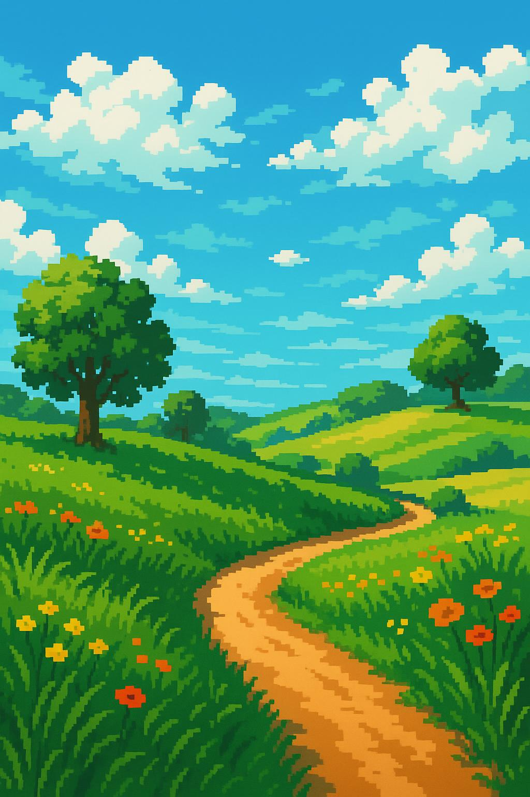
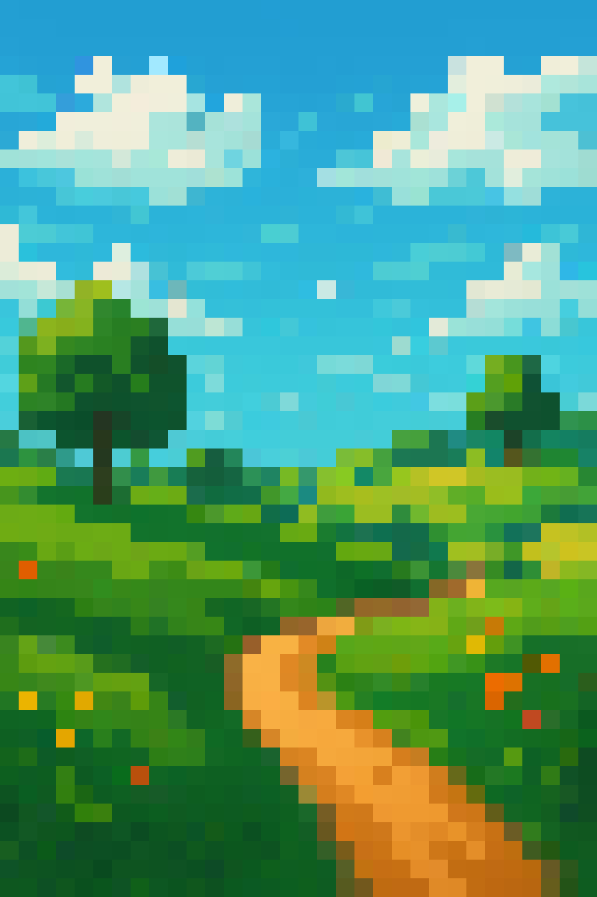

# Examples

This page showcases various use cases and practical examples to help you get the most out of Pixel Art Rust.

## Basic Examples

### Simple Photo Conversion

Convert a regular photo to pixel art:

```bash
pixel-art-rust -w 32 -h 32 -i family_photo.jpg -o pixel_family.png
```

**Result:** A 32x32 grid representation of your photo using average colors.

### High-Resolution Pixel Art

Create detailed pixel art from a high-quality image:

```bash
pixel-art-rust -w 128 -h 96 -i landscape.jpg -o detailed_landscape.png --algorithm kmeans --colors 64
```

**Result:** High-detail pixel art with 64 optimally chosen colors.

## Algorithm Comparisons

### Same Image, Different Algorithms

Starting with `portrait.jpg` (1024x768):

**Average algorithm (fastest):**

```bash
pixel-art-rust -w 48 -h 36 -i portrait.jpg -o portrait_avg.png
```

**Median Cut (balanced):**

```bash
pixel-art-rust -w 48 -h 36 -i portrait.jpg -o portrait_median.png --algorithm median-cut --colors 16
```

**K-Means (highest quality):**

```bash
pixel-art-rust -w 48 -h 36 -i portrait.jpg -o portrait_kmeans.png --algorithm kmeans --colors 16
```

### Visual Comparison Table

| Original                                            | Average                                       | Median Cut                                      | K-Means                                          |
| --------------------------------------------------- | --------------------------------------------- | ----------------------------------------------- | ------------------------------------------------ |
|  |  |  |  |

## Adaptive vs Fixed Grid

### Fixed Grid

Traditional uniform pixel grid:

```bash
pixel-art-rust -w 64 -h 64 -i cityscape.jpg -o city_fixed.png
```

### Adaptive Quadtree

Dynamic detail preservation:

```bash
pixel-art-rust --adaptive -i cityscape.jpg -o city_adaptive.png --max-depth 8 --variance-threshold 30.0
```

**Comparison:**

- Fixed grid: Uniform pixel size, consistent aesthetic
- Adaptive: More detail in complex areas, varied pixel sizes

## Specific Use Cases

### Game Development

**Creating 8-bit style sprites:**

```bash
pixel-art-rust -w 16 -h 16 -i character.png -o sprite.png --algorithm median-cut --colors 4
```

**Retro background assets:**

```bash
pixel-art-rust -w 64 -h 48 -i background.jpg -o bg_pixel.png --algorithm average
```

### Social Media

**Instagram-ready pixel art:**

```bash
pixel-art-rust -w 64 -h 64 -i selfie.jpg -o insta_pixel.png --algorithm kmeans --colors 24
```

**Twitter avatar pixelation:**

```bash
pixel-art-rust -w 32 -h 32 -i avatar.jpg -o twitter_pixel.png --algorithm median-cut --colors 12
```

### Art Projects

**Large format pixel art:**

```bash
pixel-art-rust -w 200 -h 150 -i artwork.jpg -o large_pixel.png --algorithm kmeans --colors 128
```

**Minimalist aesthetics:**

```bash
pixel-art-rust -w 24 -h 24 -i abstract.jpg -o minimal.png --algorithm median-cut --colors 6
```

## Creative Techniques

### Color Palette Experiments

**Monochrome effect:**

```bash
pixel-art-rust -w 48 -h 48 -i colorful.jpg -o mono.png --algorithm kmeans --colors 3
```

**Limited palette (NES-style):**

```bash
pixel-art-rust -w 32 -h 32 -i scene.jpg -o nes_style.png --algorithm median-cut --colors 4
```

**Rich color palette:**

```bash
pixel-art-rust -w 80 -h 60 -i photo.jpg -o rich.png --algorithm kmeans --colors 256
```

### Aspect Ratio Variations

**Square format:**

```bash
pixel-art-rust -w 64 -h 64 -i any_image.jpg -o square.png
```

**Widescreen:**

```bash
pixel-art-rust -w 128 -h 54 -i landscape.jpg -o widescreen.png
```

**Portrait:**

```bash
pixel-art-rust -w 48 -h 64 -i portrait.jpg -o tall.png
```

## Batch Processing Examples

### Process Multiple Files

**Bash script for batch conversion:**

```bash
#!/bin/bash
for image in photos/*.jpg; do
    basename=$(basename "$image" .jpg)
    pixel-art-rust -w 48 -h 48 -i "$image" -o "pixel_art/${basename}_pixel.png" --algorithm median-cut --colors 16
done
```

**PowerShell script (Windows):**

```powershell
Get-ChildItem photos\*.jpg | ForEach-Object {
    $basename = $_.BaseName
    pixel-art-rust -w 48 -h 48 -i $_.FullName -o "pixel_art\${basename}_pixel.png" --algorithm median-cut --colors 16
}
```

### Size Variations

Create multiple sizes of the same image:

```bash
# Small thumbnail
pixel-art-rust -w 16 -h 16 -i photo.jpg -o thumb_16.png

# Medium preview
pixel-art-rust -w 32 -h 32 -i photo.jpg -o preview_32.png

# Large display
pixel-art-rust -w 64 -h 64 -i photo.jpg -o display_64.png
```

## Performance Benchmarks

### Processing Time Examples

**Small images (< 1MP):**

- 16x16 grid: ~0.01s (all algorithms)
- 32x32 grid: ~0.03s (average), ~0.05s (k-means)

**Medium images (1-4MP):**

- 32x32 grid: ~0.05s (average), ~0.12s (k-means)
- 64x64 grid: ~0.15s (average), ~0.35s (k-means)

**Large images (> 4MP):**

- 64x64 grid: ~0.25s (average), ~0.60s (k-means)
- Adaptive mode: ~0.30s (varies by complexity)

### Memory Usage

**Typical memory usage:**

- Small grids (16x16): < 10MB
- Medium grids (64x64): 20-50MB
- Large grids (128x128): 100-200MB
- Adaptive mode: Varies, generally 50-150MB

## Common Workflows

### Photography to Pixel Art

1. **Start with preview:**

   ```bash
   pixel-art-rust -w 24 -h 24 -i photo.jpg -o test.png
   ```

2. **Adjust size and algorithm:**

   ```bash
   pixel-art-rust -w 48 -h 48 -i photo.jpg -o better.png --algorithm median-cut
   ```

3. **Final high-quality version:**
   ```bash
   pixel-art-rust -w 80 -h 60 -i photo.jpg -o final.png --algorithm kmeans --colors 32
   ```

### Logo Pixelation

1. **Simple logo:**

   ```bash
   pixel-art-rust -w 16 -h 16 -i logo.png -o pixel_logo.png --algorithm average
   ```

2. **Complex logo:**
   ```bash
   pixel-art-rust -w 32 -h 32 -i complex_logo.png -o pixel_complex.png --algorithm median-cut --colors 8
   ```

## Tips and Tricks

### Getting Better Results

1. **Start small, scale up** - Begin with low resolution to test composition
2. **Match input quality** - Higher quality inputs generally produce better pixel art
3. **Consider the subject** - Portraits work well with k-means, landscapes with median-cut
4. **Experiment with colors** - Different color counts can dramatically change the aesthetic

### Troubleshooting Results

**If the output is too blurry:**

- Increase grid resolution
- Try k-means algorithm
- Reduce color count for sharper edges

**If processing is too slow:**

- Use average algorithm first
- Reduce grid size
- Consider adaptive mode for large inputs

**If colors look wrong:**

- Try different algorithms
- Adjust color count
- Check input image gamma/color space

## Next Steps

- Learn about the [technical details](/algorithms/overview) of each algorithm
- Explore the [API reference](/api/cli) for advanced usage
- Check out the [CLI documentation](/api/cli) for all available options
